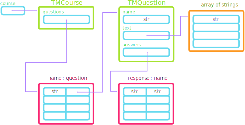
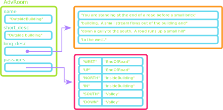

<!--
## The Adventure Begins
- In terms of the amount of code to write, Adventure is roughly comparable to the Breakout project. What makes Adventure challenging though is the interconnection of its various data structures.
- The project includes 3 separate classes:
  - `AdvGame`
  - `AdvRoom`
  - `AdvItem`
  
  each of which internally utilize Python lists, dictionaries, and tuples

## Adventure Strategies:
:::incremental
- Ensure that you thoroughly understand the `TeachingMachine.py` program before moving on to Adventure. 
  - Most of the parts you need are already there, you just need to determine how to adapt them.
- Don't try to keep the entire data structure in your head all at once. 
  - Consider each class, figure out what it does, and then think abstractly about what that class represents rather than worrying about the details
- Keep close track of what Python types your variables are storing. 
  - Choose good variable names that help you remember specifically what a particular variable is storing. Students thinking a variable has one thing in it when it is actually storing a different data type is a very common source of confusion with Adventure.
:::

## Understanding the Teaching Machine
:::{style='font-size:.9em'}
- Like the Adventure project, the `TeachingMachine.py` program is data-driven, encoding the details of its operation in data files rather than in the program itself
- The `TeachingMachine.py` program begins by reading in a data file and translating the human-readable contents of the file into an internal data structure, shown on the next slide.
- When designing the internal data structure for data-driven applications, you should consider what types of common operations the structure needs to support.
  - In the Teaching Machine, each question specifies a collection of possible answers, each of which directs to a new question. Such a relationship suggests a dictionary would be useful.
  - Similarly, the course as a whole consists of a collection of questions referenced by a unique name. Thus, once again a dictionary seems like the best internal structure.
:::


## Teaching Structure


# Problem 1
## Matching text to data structure
- As a first step toward making the conversion to the Adventure program, it is useful to draw out a similar diagram showing the desired internal data structure for the Adventure game
- In this problem you'll just focus on the `AdvRoom` class.
  - The next slide shows the contents of the first room of the `TinyRooms.txt` data file, one of the three supplied to you with the Adventure project. Draw a pencil-and-paper diagram showing what a **filled** internal data structure would look like.
  - The format of the data file has something extra that the Teaching Machine did not have: a short description. How should you incorporate that?
  - Clearly indicate the new names you will assign to each of the attributes


## `TinyRooms.txt` (Room 1)
```{.text style='max-height:900px; font-size:.8em'}
OutsideBuilding
Outside building
You are standing at the end of a road before a small brick
building.  A small stream flows out of the building and
down a gully to the south.  A road runs up a small hill
to the west.
-----
WEST: EndOfRoad
UP: EndOfRoad
NORTH: InsideBuilding
IN: InsideBuilding
SOUTH: Valley
DOWN: Valley
```

## Problem 1: One Solution

-->


# Problem 1
## A Buggy Adventure
- As Adventure builds in complexity, your debugging skills will likely be challenged, as there are many things to think about.
- Code for Adventure is split across 3-4 files: how do you determine which file is problematic?
- Adventure makes extensive use of classes: how do you decide if the problem is in how you are _using_ the class object, or in how you _defined_ the class methods?

## General Tips
- Whenever working on more complicated code, some general practices can help:
  
  :::incremental
  - Test early, test often. Write the minimal amount of code necessary before running the program to see if that code works. This constrains possible errors (usually) to the small piece of code that you just wrote.
  - Choosing strong variable names can be a lifesaver. Naming things is difficult, but naming things well can save you hours of frustrated debugging only to realize that you confused your variables.
  - Always keep a mental model (or make yourself a picture you can refer to) about where in the program certain things are happening. This is one reason why we break things up into classes and separate those classes across multiple files, but if you don't have a mental model of what is responsible for what, this division of responsibilities won't help you.
  :::

## Drilling In
- Error messages will tell you exactly in _what file_ and _what line_ the error occurred: pay attention to this!
  - Keep in mind that this is where the error occurred, **not** necessarily where the mistake occurred. But it is a good starting point.
  - If you can't find an error near this point, where else do you have code that creates or modifies the object involved? Probably in that object's class definition?
- Are you getting an illegal operation error? Go to just before that line and print out the elements involved. Something is not what you think it is.
- Don't forget that you can set break points in VSCode and run the code in debug mode! This can be easier sometimes than just using print statements.


## Problem 1
- In the materials for this section is a folder called `BrokenAdvTM`, which contains an advanced version of the TeachingMachine where someone was trying to add a points and reward system.
- This implementation adds a `TMRewards` class that stores information about potential rewards that could be tied to a problem, including the text that should display to the screen and a points modifier.
  - The rewards data file is read inside the `TMCourse` constructor when a new course is created, and every reward is randomly dispersed amongst the possible questions.
- Unfortunately there are several mistakes in the implementation. Your task in this problem is to identify those mistakes and fix them so that the program runs as intended.
   - There are only 3 mistakes in the file, requiring only editing about 5 lines of code


## Issue 1
:::incremental
- Likely the first issue you are faced with is about a string having no attribute `add_reward`, which is true!
- It is important not to confuse the _name_ of something with the custom object _representing_ that thing
  - The name of a question is **not** the same thing as the `TMQuestion` itself
- Possible fix? 
  - Use the name of the question as the key to the questions dictionary to retrieve the actual corresponding object, and then call `add_reward` on that object
:::

## Issue 2
:::incremental
- The second issue you will likely face is when you come across one of the rewarded questions (which might require a bit of testing!) that will complain about list objects having no `get_text` attribute.
- The list in question is the `rewards` variable that was returned by `.get_rewards()`, which looks to contain a list of all the rewards associated with a problem.
- The fix?
  - Individual reward objects **do** have a method `get_text()`, so likely what was desired is to loop over the rewards and print the text of each.
:::

## Issue 3
:::incremental
- The third issue can be subtle without good testing.
- The `rewards.txt` file shows 3 rewards in it, each of which should be assigned to a question.
  - Can you find them all? Or are some missing?
- Check to ensure the objects you read in from a file have all the expected things! Here we are missing two rewards!
- The culprit has to do with the empty row between each of the rewards. Without changing the `rewards.txt` file itself, how could you fix this?
  - Explicitly read in an extra line after the multiplier
:::

# Problem 2
## Providing feedback
:::incremental
- Currently, the `TeachingMachine.py` program gives no feedback when the user gives an incorrect answer.
  - Quickly brainstorm some ways you could try to implement this? What extra data structures might you need?
- There are many possible strategies, but the one Will Crowther arrived at was reusing the `AdvRoom` class (`TMQuestion` here)
  - Want the new "question" to display text to the screen, but **not** to prompt the user for a response
  - Instead, a `FORCED` response in the `answers` dictionary indicates that the program should **immediately** proceed to the indicated question
:::


## Forced Questions
- An example of such a question might look like:
  ```text
  Q3Resp
  You forgot to divide by 2.
  -----
  FORCED: Q3
  ```
- Implementing this in `TMCourse.py` requires only a small change:
  - The `run` method for `TMCourse` is shown on the next slide. Identify on what lines changes will need to be made.
  - Make the changes to allow for `FORCED` questions in the Teaching Machine.


## `TMCourse.run` {data-auto-animate=true}
```{.mypython style='max-height:900px; font-size:.8em' data-id='mycode' data-line-numbers='|8-9'}
def run(self):
    """Steps through the questions in this course."""
    current = "START"
    while current != "EXIT":
        question = self._questions[current]
        for line in question.get_text():
            print(line)
        answers = question.get_answers()
        response = input("> ").strip().upper()
        next_question = answers.get(response, None)
        if next_question is None:
            next_question = answers.get("*", None)
        if next_question is None:
            print("I don't understand that response.")
        else:
            current = next_question
```

## `TMCourse.run` {data-auto-animate=true}
```{.mypython style='max-height:900px; font-size:.8em' data-id='mycode' data-line-numbers='8,11|9-10|19-20'}
def run(self):
    """Steps through the questions in this course."""
    current = "START"
    while current != "EXIT":
        question = self._questions[current]
        for line in question.get_text():
            print(line)
        answers = question.get_answers()
        forced_question = answers.get("FORCED", None)
        if forced_question is None:
            response = input("> ").strip().upper()
            next_question = answers.get(response, None)
            if next_question is None:
                next_question = answers.get("*", None)
            if next_question is None:
                print("I don't understand that response.")
            else:
                current = next_question
        else:
            current = forced_question
```
